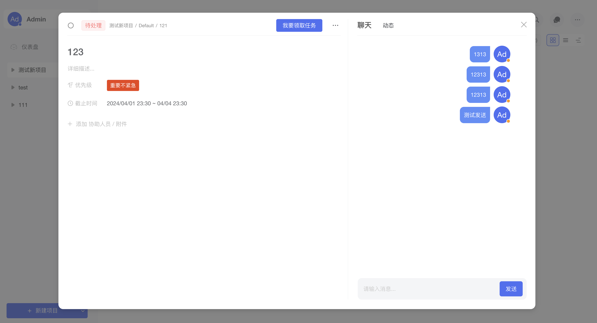

# autoopm

#### 介绍
Autoopm - 最好用的项目管理工具。提供团队管理、项目管理、任务分发、文件管理、即时IM、在线思维导图等工具；使用悟空IM作为即时IM 的底层，后端使用springboot + magic api 开发，可以实现API接口的快速二次开发。

文件：minio + onlyoffice 

聊天：悟空im

#### 软件架构
后台由 springboot + magic api + mysql

功能列表：

1、团队管理

2、系统设置

3、个人设置

4、项目管理

5、文件管理

6、聊天

计划中：

1、文件管理

2、聊天消息全局管理

3、思维导图集成

作者 qq：177478191

ps：欢迎大家提 issue

页面截图

