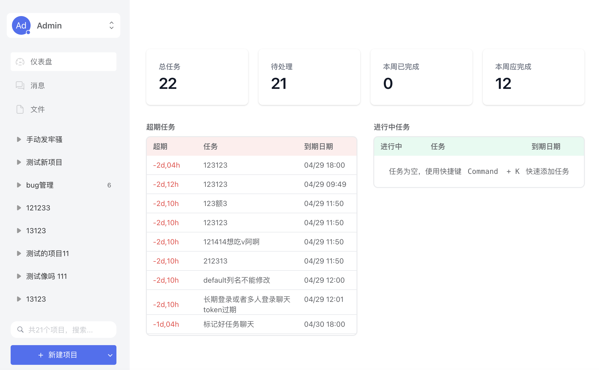
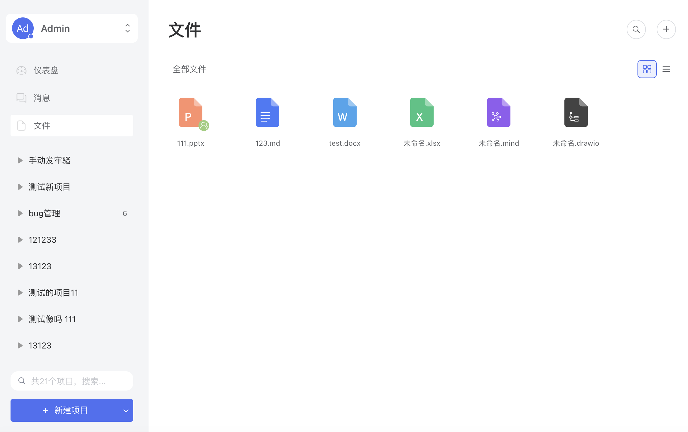
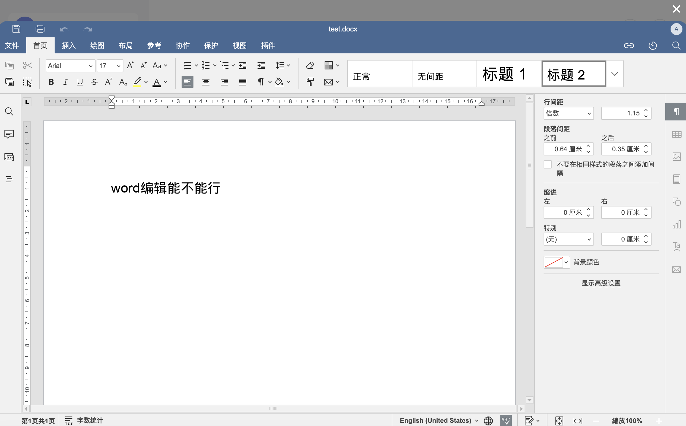
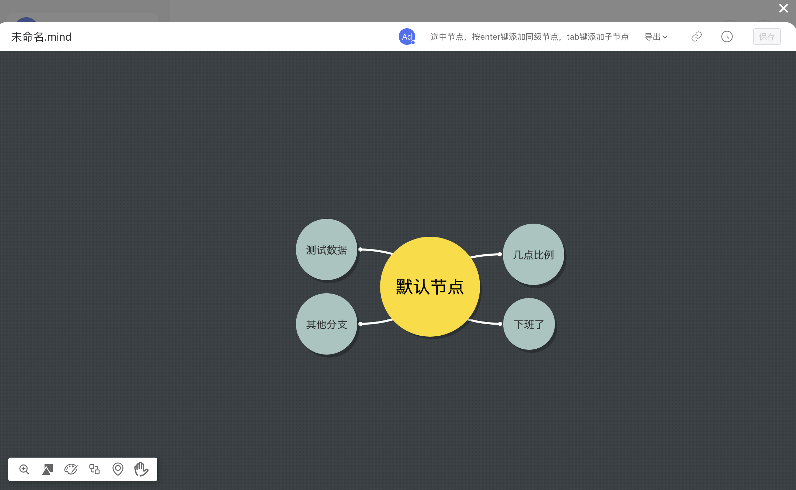
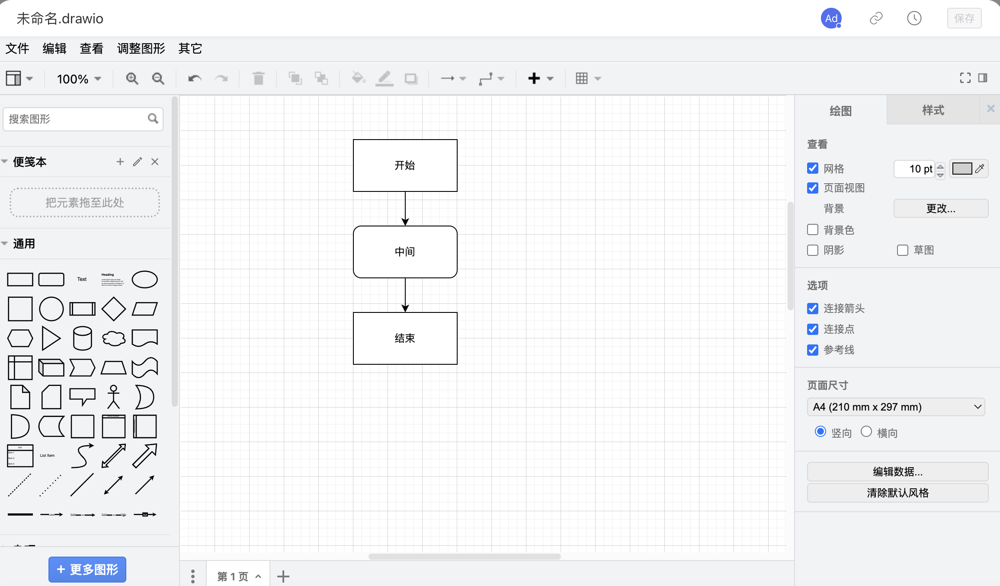
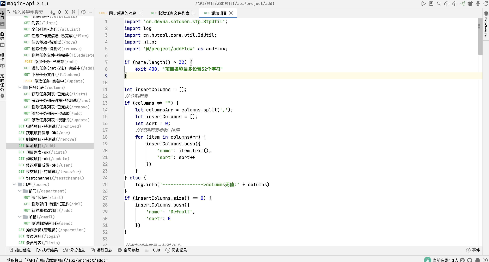

# autoopm

#### 介绍
Autoopm - 最好用的项目管理工具。提供团队管理、项目管理、任务分发、文件管理、即时IM、在线思维导图等工具；使用悟空IM作为即时IM 的底层，后端使用springboot + magic-api 开发。

#### 演示地址：

[点击跳转](http://82.157.62.190:8200)

#### 软件架构

后台：springboot + magic-api + mysql

文件：minio + onlyoffice + drawio

聊天：悟空im

前端：vue2

功能列表：

1、团队管理

2、系统设置

3、个人设置

4、项目管理

5、文件管理

6、消息管理

辅助安装下载或者功能定制请联系作者 qq：177478191

ps：欢迎大家提 issue

页面截图

