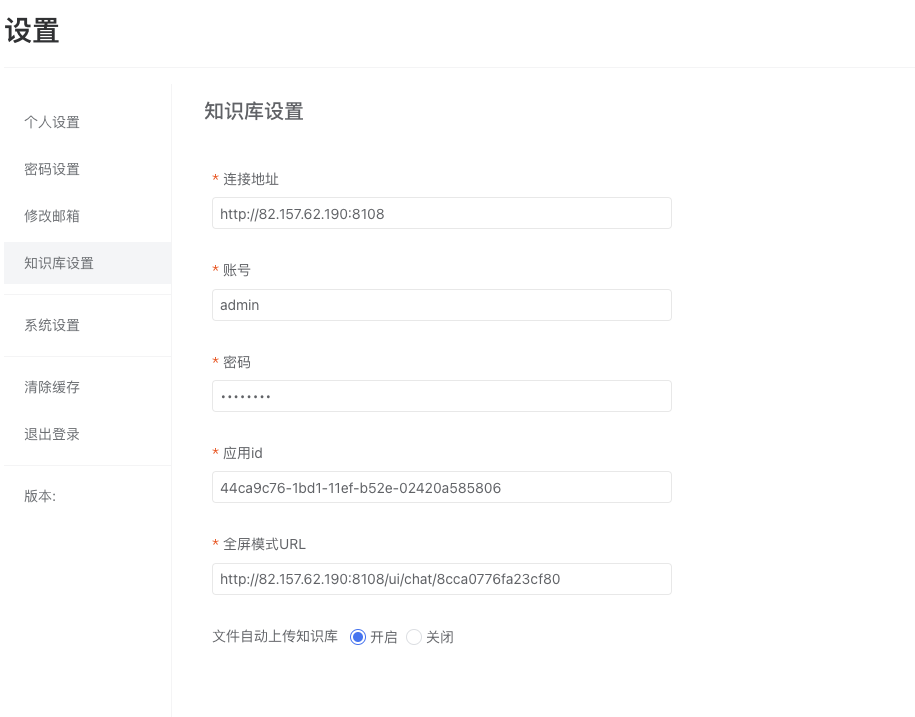
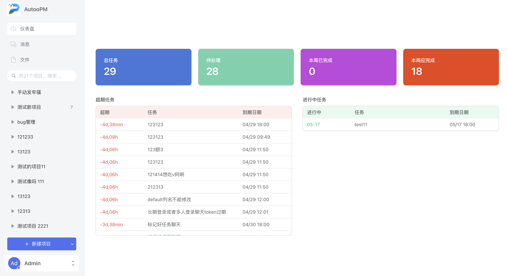
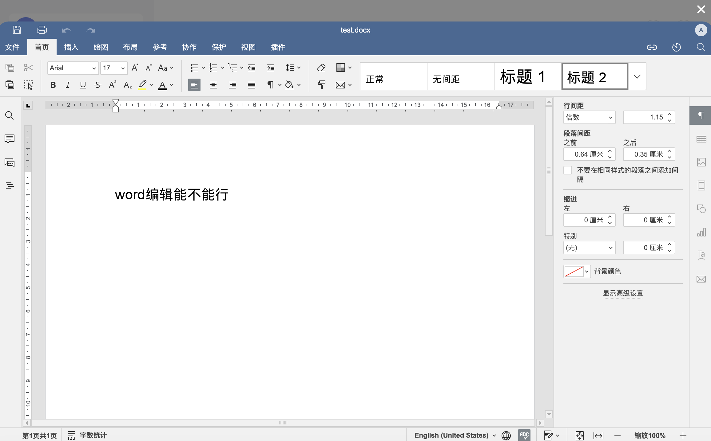
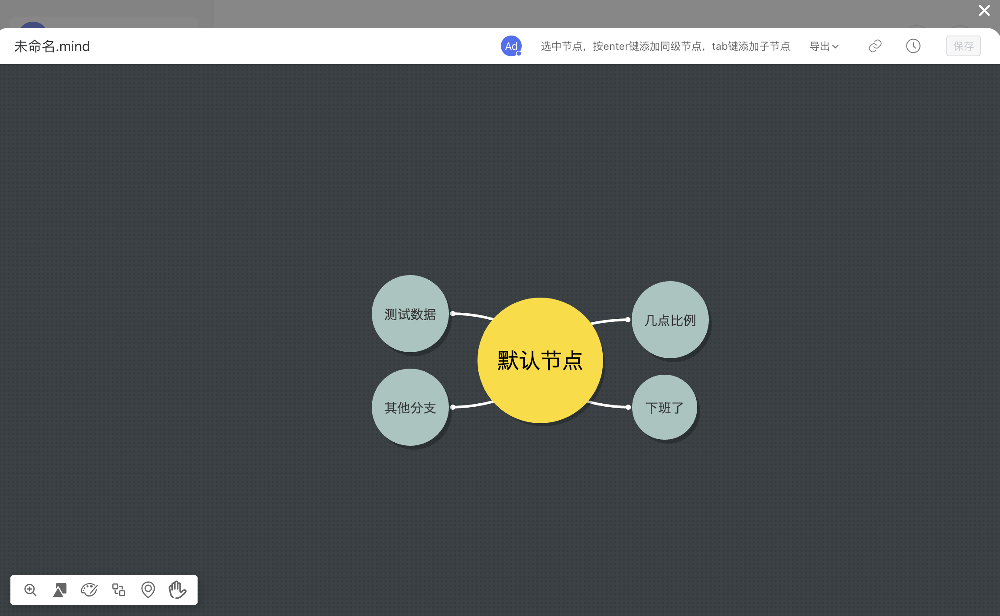
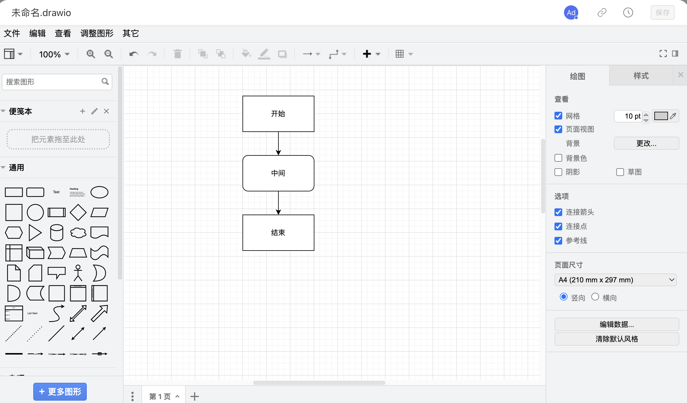
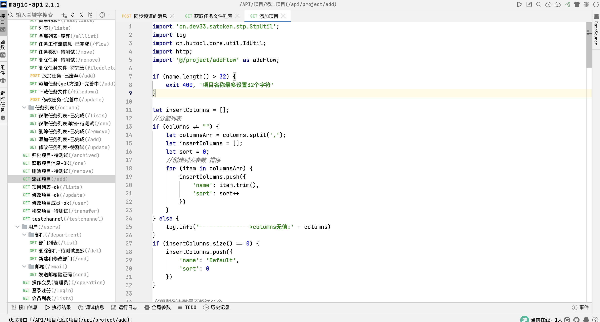

# autoopm

#### 介绍
Autoopm - 最好用的项目管理工具。提供团队管理、项目管理、任务分发、文件管理、即时IM、在线思维导图等工具；使用悟空IM作为即时IM 的底层，后端使用springboot + magic-api 开发。

#### 演示地址：

[点击跳转](http://82.157.62.190:8200)

#### 软件功能

功能： 团队管理、 系统设置、个人设置、项目管理、文件管理、消息管理、知识库

辅助安装下载或者功能定制请联系作者 qq：177478191

ps：如果觉得项目不错，请star，欢迎大家提issue

安装部署：

1、安装docker

curl -fsSL https://get.docker.com | bash

2、安装docker compose

curl -L "https://github.com/docker/compose/releases/download/v2.20.3/docker-compose-$(uname -s)-$(uname -m)" -o /usr/local/bin/docker-compose

chmod +x /usr/local/bin/docker-compose

ln -s /usr/local/bin/docker-compose /usr/bin/docker-compose

3、拉取本项目代码

git clone git@gitee.com:autoopm/autoopm.git

4、修改本地的对外ip地址

替换./service/src/main/resources/application.yml中的public:domain的地址（用于填充图片预览路径的，不要填127.0.0.1或localhost）

5、进入目录并执行安装

cd autoopm && ./setup.sh

6、导入magic-api接口

打开服务器ip:8081/magic/web/index.html，将根目录下的data下面的magic-api.zip全量导入

7、配置知识库

打开服务器ip：8108/ui/login，使用账号密码（admin/MaxKB@123..）登录，配置模型、应用和知识库，并将相关配置填写到系统设置-知识库设置中。

[知识库使用手册](https://github.com/1Panel-dev/MaxKB/wiki/1-%E5%AE%89%E8%A3%85%E9%83%A8%E7%BD%B2
)

页面截图

