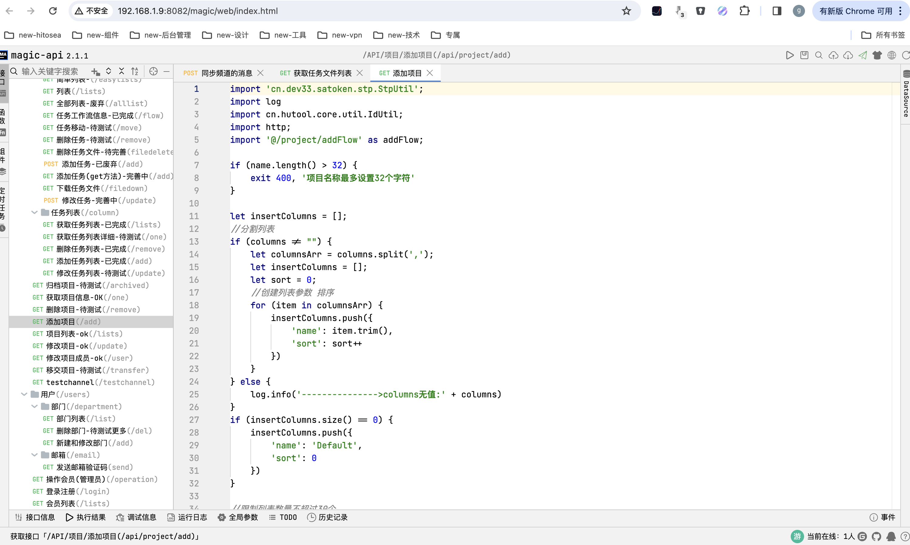

# autoopm

#### 介绍
Autoopm - 最好用的项目管理工具。Autoopm 是由 springboot + magic api + vue2 的轻量项目管理软件，后台使用springboot + magic api 开发，无需定义Controller、Service、Dao、Mapper、XML、VO等Java对象，可以实现快速的API接口的二次开发。

文件：minio
聊天：悟空im

#### 软件架构
后台由 springboot + magic api + mysql

页面截图

