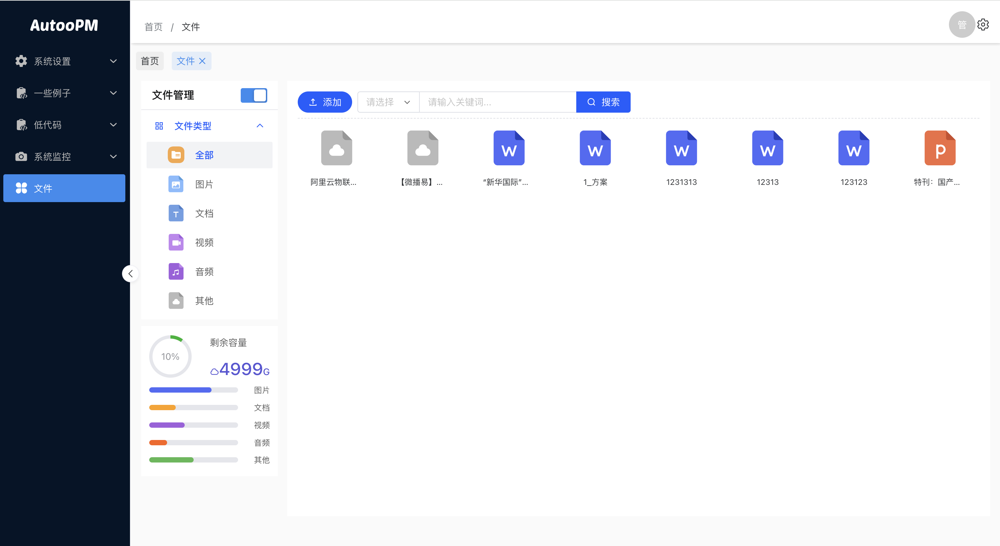
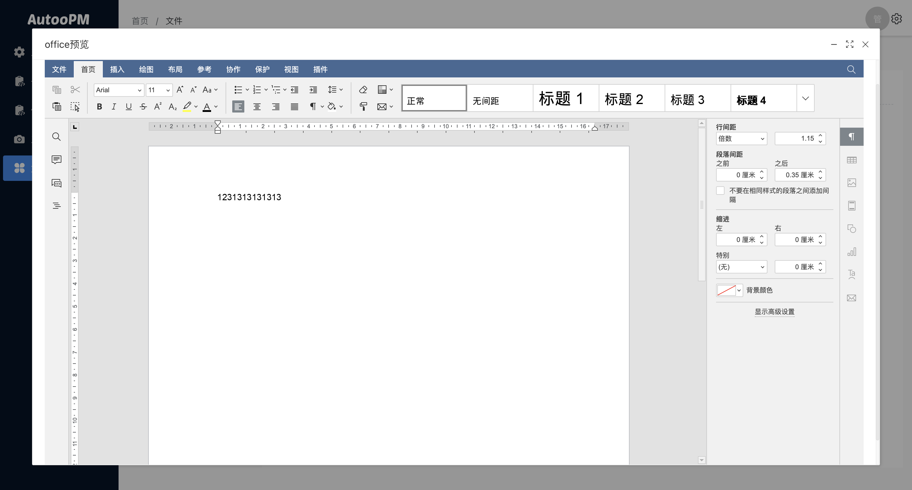
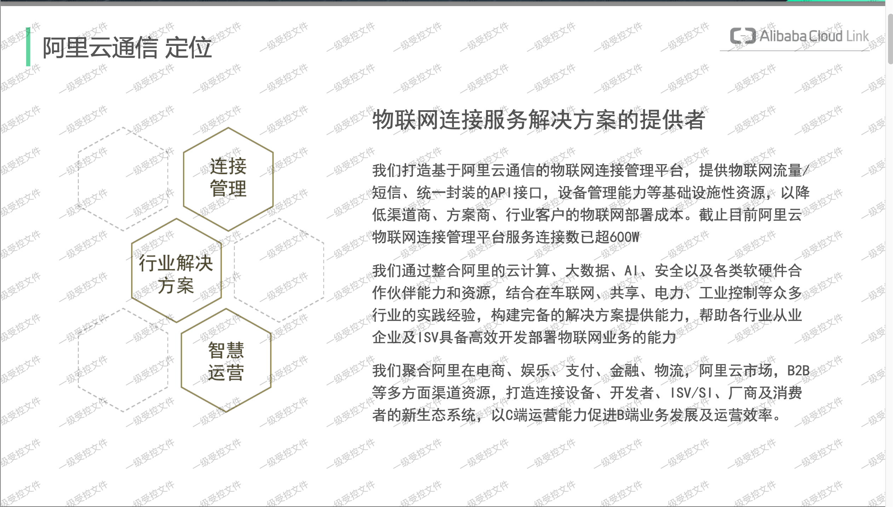

##

## 简介

一款功能全面、安全可靠的受控文件管理系统，它采用先进的权限控制机制、在线编辑和预览技术，结合水印保护策略，为用户提供高效、便捷的文件管理体验，是企业数字化转型的得力助手。

| 效果                                         |
|--------------------------------------------|
|  |

## 功能
- 文件上传：支持常见的文件类型，如文档、图片、视频、音频等
- 文件下载：下载系统中有下载权限的文件
- 文件预览：在线预览有可读权限的文件，包括办公文档、视频、图片等
- 水印保护：下载的pdf和docx文档会自动添加水印

## 系统截图
  
  
  
